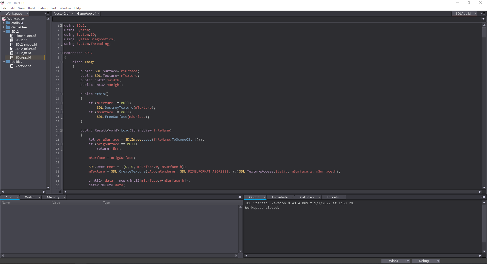

# The *BEST* theme is now available for your favorite Beefy IDE!

## Installation:
1. Download the repo, unzip it somewhere. I dont care.
2. Copy `Base16Tomorrow.toml` under "C:\Program Files\BeefLang\bin\themes" (if 'themes' doesn't exsist, create it)
3. Open Beef IDE
4. Open Settings
4. Under UI Set the Theme property to Base16Tomorrow.toml

5. Hit *apply*
6. Aquire tissues to wipe the tears of joy for you are now witnessing pure **beauty**.

Inspired by chriskempson's[Tomorrow Night ](https://github.com/chriskempson/tomorrow-theme)

[Ko-Fi](https://ko-fi.com/jmacklin308)
